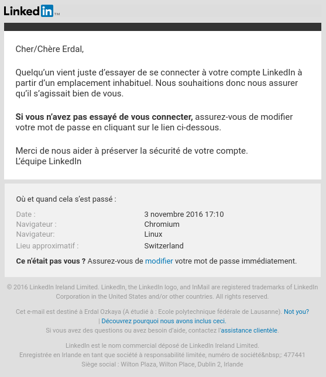
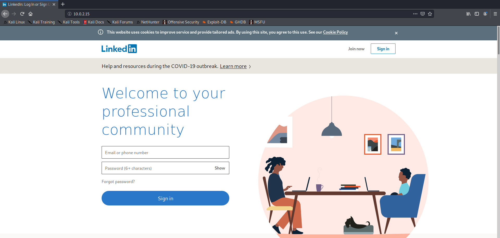

# Auteurs : Lionel Burgbacher, Eric Noel, Jeremy Zerbib

# PROJET SEN : Spear Phishing

## Simulation d'attaque

## Table des matières 

1. [ Descriptions et explications de chaque étape de l'attaque ](#desc)

  1.1. [ Cloning du mail ](#clm) 

  1.2. [ Cloning du site afin de se logger ](#cls)

2. [ Descriptions et actions effectuées par la cible ](#descA)

3. [ Descriptions des résultats obtenus dans le cas d'une attaque réussie ](#descR)

### 1. Descriptions et explications de chaque étape de l'attaque

Nous avions trouvé lors de la phase de recherche que le mail trouvé était utilisé sur LinkedIn, facebook et instagram.
De ce fait, nous aimerions trouver le mot de passe d'une de ces plateformes, LinkedIn dans notre cas, pour peut-être trouver les mots de passe des autres sites.

#### 1.1. Cloning du mail

Lors de cette étape, nous avons cloné un mail sur une base connue.
En effet, nous avons créé un compte fictif et simulé le comportement suivant :
- Tentative de login depuis une source inconnue
- Réception d'un mail nous signalant la tentative
- Copier-coller le contenu du mail en `HTML` et ajustement des champs de manière à faire croire que le mail est vraiment destiné à notre cible.  

Le résultat est celui-ci :  

#### 1.2. Cloning du site afin de se logger

En utilisant `SEToolkit`, il est possible de répliquer la page d'accueil de LinkedIn.
En suivant les étapes `Website Attack Vector -> Credential Harvester Method -> Site Cloner`, le site est repliqué sur l'adresse locale ou globale de notre choix.
Le résultat nous donne ceci :  

### 2. Descriptions et actions effectuées par la cible (ouverture d'un trojan, faux site web etc...)
La cible a reçu un mail lui indiquant qu'une connexion a été établie avec son compte.
Il clique sur le lien et arrive sur l'adresse forgée pour notre attaque.
La cible rentre ses anciens *credentials* afin de se connecter et chager son mot de passe et nous obtenons les anciens identifiants de cette personne.
Si le même mail est utilisé pour différents réseaux ou le mot de passe correspond à une phrase connue, il est possible d'extrapoler d'autres mots de passes.  

Etant donné que le mail reçu par notre cible est identique à celui de Linkedin, il est facile de croire qu'elle ne se doutera de rien.

### 3. Descriptions des résultats obtenus dans le cas d'une attaque réussie
Nous n'avons pas lancé cette attaque en réel pour des raisons évidentes mais en la simulant, nous avons trouvé quelques informations intéressantes.
En effet, notre cible ayant rentrée ses identifiants sur notre portail piégé, il a été possible de trouver certains accès à d'autres sites comme Facebook, twitter, instagram et même son propre site.  

Il y a alors différents plan d'action possible : 
- Chantage envers la cible pour nous faire taire.
- Divulgation des informations pour perte de crédibilité
- Usurpation d'identités pour continuer la chaine d'attaques

