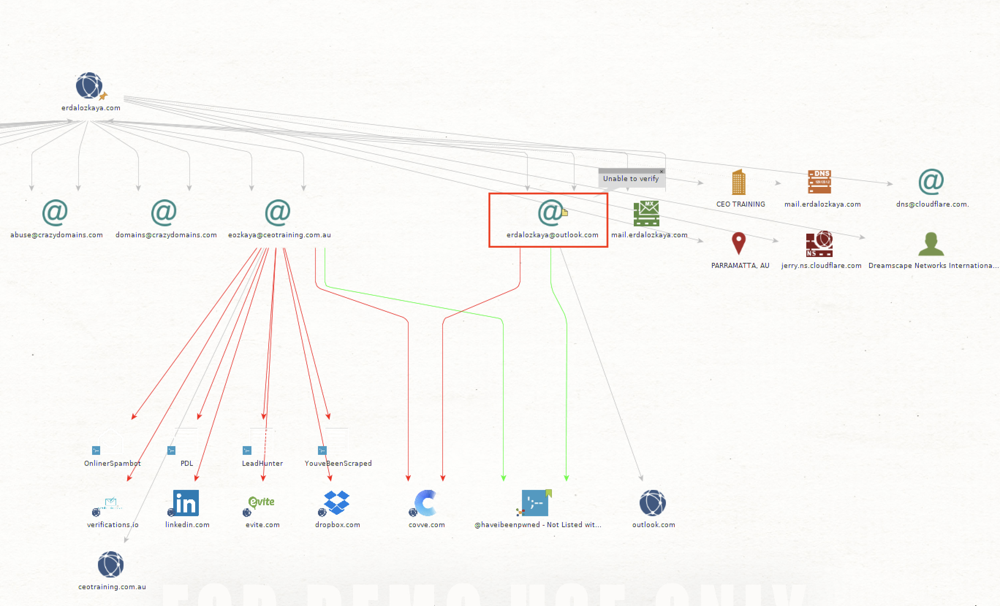

# Auteurs : Lionel Burgbacher, Eric Noel, Jeremy Zerbib

# PROJET SEN : Spear Phishing

## Recherche d'informations sur sa cible

## Table des matières 

1. [ Target ](#target)
2. [ Contacts et Informations ](#candi)
3. [ Personnalité ](#perso)
4. [ Parcours professionel et académique ](#parc)
5. [ Vie privée ](#vp)
6. [ Maletgo ](#malt)

## 1. Target

Nous avons choisi comme cible Erdal Ozkaya, étant lui même un expert en cyber sécurité et ayant écrit un livre sur l'ingénierie sociale, nous avons trouvé intéressant de voir à quel point il protégeait ses données et à quel point il était possible d’en trouver. Le but d'une attaque sur cette cible  serait de la décrédibilisée auprès de la communauté et des experts pour ainsi compromettre sa réputation.

## 2. Contact et informations

Nous avons trouvé plusieurs moyen de contacter la cible, en voici la liste:

Via la séction contacte de son blog : https://www.erdalozkaya.com/contact/

Son email à la Charles Sturt University : eozkaya@csu.edu.au

Via ses réseaux sociaux :

- Twitter : https://twitter.com/Erdal_Ozkaya
- Facebook : https://www.facebook.com/ErdalOzkaya
- Instagram : [Erdal Ozkaya (@erdalozkaya)](https://www.instagram.com/erdalozkaya/)
- Linkedin : https://ae.linkedin.com/in/erdalozkaya

## 3. Personnalité

Il n’est pas facile d'affirmer quelle est la personnalité d’une personne. Cependant on peut tout de même supposer plusieurs choses sur notre cible. Notre cible aime voyager, ça se voit facilement sur son profile instagram sur lequel on peut trouver des photos de lui dans des dizaines et des dizaines de Villes différentes.Il est présent sur la majorité de ses photos et les prend souvent lui-même, on peut alors aussi dire que c’est une personne plutôt extraverti et confiante. Cela se voit aussi dans les multiples conférences qu’il donne.Il semble aussi, le plus souvent, être entouré de plusieurs personnes ce n’est donc probablement pas quelqu’un de solitaire. On peut également supposer que la liste ci-dessous de ses favoris facebook est correcte et encore à jour. Tout ça nous donne une meilleur idée de ce qu’il aime et peut être un vecteur d’attaque. 

Favoris (facebook) :

- Musique : Harun Kolçak
- Livre : Özgür Özan
- Films : iki iyi Çocuk
- Télévision : Beyaz Show
- Jeux : Xbox
- Athlètes : Mesut Özil
- Équipes sportives : FC Bayern München
- Personnes inspirante : Atatürk

source : https://www.facebook.com/ErdalOzkaya

## 4. Parcours professionel et académique

Nous avons pu retrouver une partie du parcour scolaire de la cible. Nous n’avons pas pu retrouver son parcour de scolarité élémentaire mais à partire de sa première université nous pensons avoir tout trouvé.

- 1997 2001 Linguistic in Germanistic, IT Support @ Hacettepe Üniversitesi
- 2001 2004 Network Engineer in Network Management @ TAFE
- 2004 2006 Bachelor of Information and Communications Technology @ University of Western Sydney
- 2010 2012 Master of Information Systems Security in IT Security @ Charles Sturt University
- 2013 2018 Doctor of Information Technology in IT Security @ Charles Sturt UniversityMaster of Computing Research @ Charles Sturt University

Nous avons également trouvé l’essentiel de son parcour professionnel.
- 1992 - 1996 IT Support Technician @ Sigerland Computers, Siegen Area, Germany
- 1997 - 2001 IT Administrator @ Hacettepe University, Ankara, Turkey
- 2001 - 2002 IT Director @ The Bright Group, Australia, China, USA
- 2002 - 2011 Managing Director/ Lead Architect and Trainer @ CEO IT Solutions, Australia
- 2012 - 2012 Chief Technology Officer @ Fastlane Asia Pacific, Sydney, Australia
- 2013 - 2014 Regional Director @ KEMP Technologies, Australia , Asia Pacific
- 2014 - 2016 Chief Information Security Officer / Vice President @ Secunia (emt Holding), Dubai, United Arab Emirates
- 2016 - 2019 Cybersecurity Architect @ Microsoft, Europe, Middle East, Africa
- 2019 - Aujourd’hui Regional Chief Information Security Officer , Managing Director / Head of Information and Cyber Security / Managing Director @ Standard Chartered Bank, Dubai, United Arab Emirates

A temps partiel :
- 2012 - Aujourd’hui Lecturer @ Charles Sturt University, Sydney, Australia

Il fait également partie des groupes suivant :
- 2018 - Aujourd’hui The Board Of Advisors, Binalyze, World
- 2019 - Aujourd’hui Australian Institute of ICT, Sydney, Australia

source : https://ae.linkedin.com/in/erdalozkaya

## 5. Vie pivée

D’après les informations trouvées, il habite à Dubaï. Cette information vient de Twitter, Linkedin, etc. On trouve aussi un tweet le 24 mai concernant la fête de la fin du Ramadan, ainsi que des réponses le lui souhaitant aussi. Bien que cela n’affirme pas qu’il soit musulman, on peut quand même estimé qu’il l’est. 
Son profile instagram est publique, il est possible trouver plusieurs photos de lui et de sa famille. On y trouve ses enfants, sa femme et sa maman. On trouve ainsi que le compte de sa femme : arzu_idrisolgu_ozkaya. Bien que cette information soit importante, les comptes de sa famille sont privés. Il n’est pas pas possible de trouver directement des informations depuis leur compte. Mais il serait possible de trouver d’autres informations en utilisant le même procédé que pour lui et peut-être ainsi en trouver.

## 6. Maltego

Avec les informations obtenues sur les réseaux sociaux ainsi que les moteurs de recherches, nous avons voulu vérifier s’il était possible d’en trouver d’autres avec des outils tel que maltego. 
En entrant son site personnel dans la recherche, nous avons trouvé les informations suivantes : 

On constate qu’une adresse mail est plausible pour cette personne [erdalozkaya@outlook.com](mailto:erdalozkaya@outlook.com). On teste première l’adresse [eozkaya@ceotraining.com.au](mailto:eozkaya@ceotraining.com.au) sur un compte tel que linkedin pour voir si le compte existe vraiment, sachant que maltego pointe sur un lien likendin. 

On constate que le compte n’existe pas. 

On fait un deuxième essaie avec le compte [erdalozkaya@outlook.com](mailto:erdalozkaya@outlook.com) : 

Dans ce cas, on constate effectivement qu’un compte existe. Cela n’implique pas ce compte soit le vrai mais sachant que l’adresse mail a été déduite par maltego à partir de son site personnel, on peut imaginer qu’il s’agisse bien d’une adresse lui appartenant. 

On peut aussi essayer avec d’autres réseaux sociaux: 

On constate qu’un compte existe aussi, il en va de même pour instagram. 

Les autres informations ne sont pas très parlante.
En cherchant directement à partir des emails que nous connaissons, nous ne trouvons que très peu d’information. 

Avec ces informations, il est maintenant possible de créer une attaque ciblée sur cette personne. Ayant obtenu un compte, il nous reste à trouver un moyen de trouver le mot de passe.