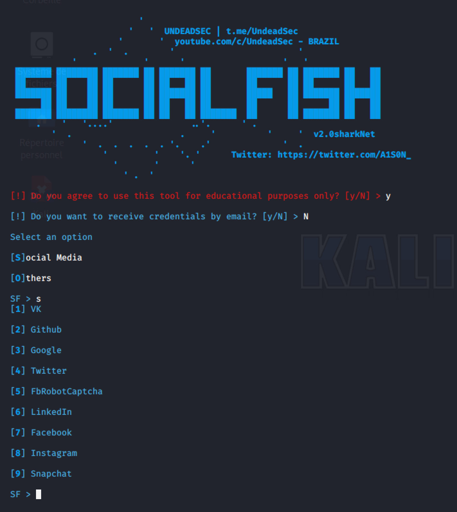
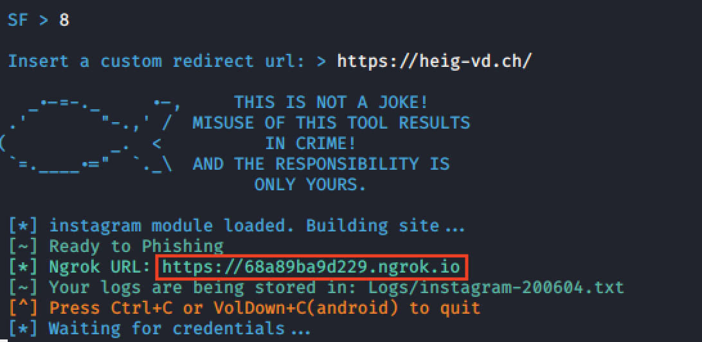
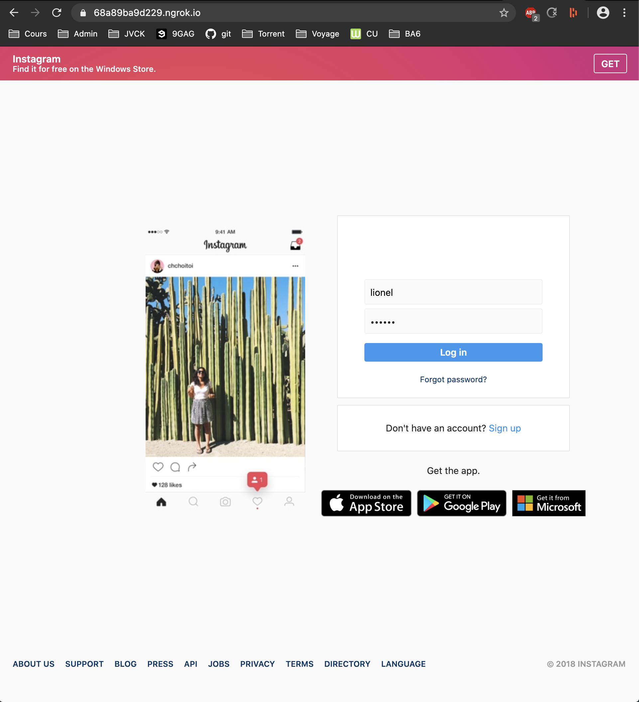
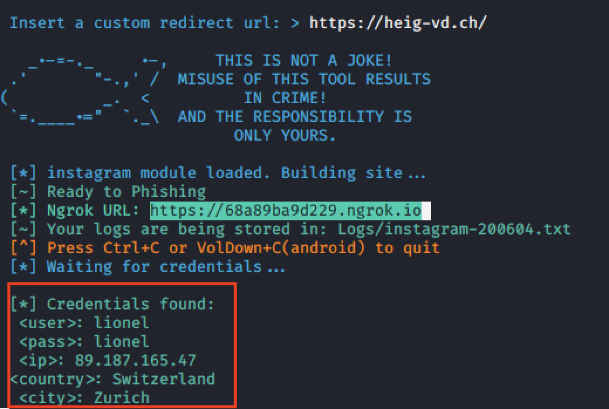

# Auteurs : Lionel Burgbacher, Eric Noel, Jeremy Zerbib

# PROJET SEN : Spear Phishing

## Social Fish

## Table des matières 

1. [ Introduction ](#intro)
2. [ Installation ](#install)
3. [ Descritption approfondie](#desc)
4. [ Démonstrations des possibilités ](#demo)
5. [ Conclusion ](#conc)
6. [ Sources ](#src)

<a name="intro"></a>

## 1. Introduction

SocialFish est un outil permettant la copie des réseaux sociaux les plus populaires (Facebook, Twitter, etc.). Nous avions déjà testé des outils de ce type pendant les laboratoires de SEN comme SET (bien plus d'outils différents disponibles). Avec SET, il était possible de copier un site en local ou de le mettre sur un serveur connecté à internet pour ensuite récupérer les credentials, mais son utilisation demandait plus de connaissance. Ici l'utilisation est bien plus ciblée. Pour utiliser cet outil, il suffit d'avoir python installer sur une machine. Il est donc possible de l'utiliser sur tous les systèmes d'exploitation. Son utilisation est tellement simple que tout le monde peut l'utiliser, même un néophyte. Son modèle économique est basé sur la donation, cependant le projet semble avoir été abandonné.

<a name="install"></a>

## 2. Installation

Tout système ayant python installé permet d'utiliser ce logiciel. 

La nouvelle version ne contient pas ngrok, il faut donc télécharger les sources sur le lien suivant : 

```https://github.com/UndeadSec/SocialFish/releases/tag/sharkNet```

Une fois le fichier télécharger il faudra utiliser la commande cd pour se déplacer dans le dossier ainsi que unzip pour extraire l'archive. 

Il ne reste plus qu'à installer les dépendances : 

```pip install -r requirements.txt```

Pour lancer le logiciel : 

```python3 SocialFish.py```

<a name="desc"></a>

## 3. Descritption approfondie

Le choix s'est porté sur ce logiciel pour sa simplicité vraiment déconcertante. Ces possibilités sont très restreintes et il ne permet donc que la copie d'un site spécifique, mais aussi ça mise en "ligne". Pour cela on utilise Ngrok, un revers proxy, qui permet de rendre public le site hébergé localement. Il est bien sûr possible d'utiliser ce type de logiciel avec SET, mais ça ne sera pas aussi simple qu'avec SocialFish.

Le cas d'utilisation le plus logique est donc le vol de donnée sur un site bien défini. On peut donc envoyer à l'aide d'un autre outil des emails avec le lien obtenu pour espérer récupérer des credentials. On peut donc cibler une ou plusieurs cibles. Une fois des credentials obtenus, il sera possible de prendre contrôle du compte de la personne (modifier le mot de passe, supprimer le compte, etc.), mais aussi d'essayer ces credentials sur d'autres applications en sachant que beaucoup de gens utilisent souvent les même mot de passe et nom d'utilisateur plusieurs fois. 

<a name="demo"></a>

## 4. Démonstrations des possibilités

Nous allons démontrer ici la facilitée d'utilisation de ce logiciel. On a donc 2 choix, s et o. S contient les réseaux sociaux et o contient Stackoverflow, wordpress etc. Le choix se porte ici sur s. 



On choisit le réseau social instagram et on donne une redirection. Dans notre cas, il s'agit du site de la HEIG-VD mais dans un cas concret on pourrait faire une redirection sur le site original pour que cela ne semble pas suspect. On trouve aussi (Rectangle rouge)  le lien d'ou la copie du site est accessible. C'est ce lien qu'il faut envoyer à la victime. 



On voit bien l'adresse et  la copie du site sur l'image suivante : 



Une fois les credentials validés, nous avons bien une redirection sur le site de la HEIG-VD.


On trouve dans la console le mot de passe et le le nom d'utilisateur avec aussi la localisation dans ce cas zurich car un vpn est activé. 



<a name="conc"></a>

## 5. Conclusion

Nous avons ici le cas d'un logiciel qui peut faire beaucoup de dégâts. Du simple adolescent à des gens plus expérimentés, tout le monde peut l'utiliser.  Il suffit de connaître l'adresse mail de ça cible et de forger un email plausible pour espérer trouver des couples nom d'utilisateur/mot de passe. Il y a tellement de gens qui cliquent partout sans faire attention. Il permet avec très peu de connaissance informatique de voler des données facilement.

<a name="src"></a>

## 6. Sources 

https://github.com/UndeadSec/SocialFish
https://www.cachem.fr/ngrok-tunnel-applications-locales/