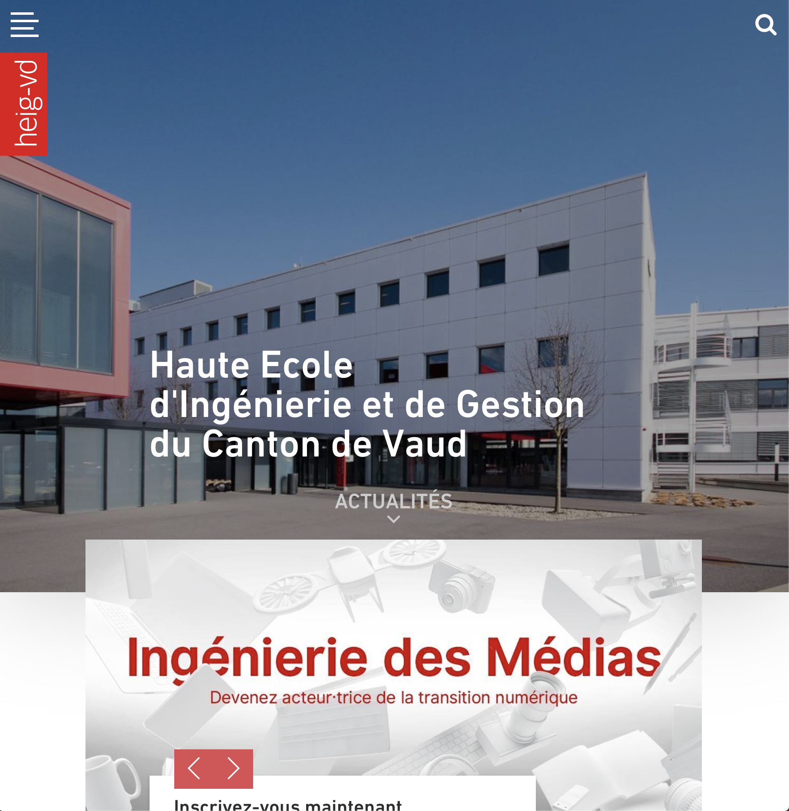

# Auteurs : Lionel Burgbacher, Eric Noel, Jeremy Zerbib

# PROJET SEN : Spear Phishing

## Social Fish

## Table des matières 

1. [ Introduction ](#intro)
2. [ Installation ](#install)
3. [ Cas d'utilisation ](#casu)
5. [ Conclusion ](#conc)

<a name="intro"></a>

## 1. Introduction

SocialFish est un outil permettant la copie des réseaux sociaux les plus populaires (Facebook, Twitter, etc.). Nous avions déjà tester des outils de ce type pendant les laboratoires de SEN comme SET. Avec SET, il était possible de copier un site en local ou de le mettre sur un serveur connecté à internet pour ensuite récupérer les credentials.  Ngrok(un revers proxy) permet d'avoir un serveur directement connecté à internet. Son utilisation est tellement simple que tout le monde peut l'utiliser, même un néophyte. 

<a name="install"></a>

## 2. Installation

Tout système ayant python installé permet d'utiliser ce logiciel. 

La nouvelle version ne contient pas ngrok, il faut donc télécharger les sources sur le lien suivant : 

```https://github.com/UndeadSec/SocialFish/releases/tag/sharkNet```

Une fois le fichier télécharger il faudra utiliser la commande cd pour se déplacer dans le dossier ainsi que unzip pour extraire l'archive. 

Il ne reste plus qu'a installer les dépendances : 

```pip install -r requirements.txt```

Pour lancer le logiciel : 

```python3 SocialFish.py```

<a name="casu"></a>

## 3. Cas d'utilisation

Nous allons démontrer ici la facilité d'utilisation de ce logiciel. On a donc 2 choix, s et o. S contient les réseaux sociaux et o contient Stackoverflow, wordpress etc. Le choix se porte ici sur o. 


On choisit le réseau social instagram et on donne une redirection. Dans notre cas, il s'agit du site de la HEIG-VD mais dans un cas concret on pourrait faire une redirection sur le site original pour que cela ne semble pas suspect. On trouve aussi (Rectangle rouge)  le lien d'ou la copie du site est accessible. C'est ce lien qu'il faut envoyer à la victime. 


On voit bien l'adresse et  la copie du site sur l'image suivante : 


Une fois les credentials validé, nous avons bien une redirection sur le site de la HEIG-VD.



On trouve dans la console le mot de passe et le le nom d'utilisateur avec aussi la localisation dans ce cas zurich car un vpn est activé. 


<a name="conc"></a>

## 4. Conclusion

Ce logiciel est très simple d'utilisation. Il permet avec très peu de connaissance de voler des données facilement. Pour créer une attaque réelle, il faut envoyé ce lien à une ou plusieurs personnes. Il existe des moyens pour rendre les liens moins suspects. 